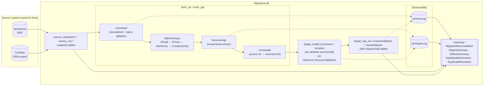

# MigrationLab (SQL Server) – Enterprise Data Migration Simulation

[](https://github.com/MarioNagi/MigrationLab/actions/workflows/ci.yml)

This repository is a **SQL-first**, **tool-agnostic**, and **public-safe** data migration lab inspired by large ERP migrations (SAP-like), built to be:

- Production-realistic
- End-to-end
- Repeatable
- GitHub / LinkedIn friendly

## Databases

The lab uses **three SQL Server databases**:

1. **Northwind** (Source system #1 – ERP-like)
   - Read-only reference dataset
   - Classic Northwind schema

2. **CsvRaw** (Source system #2 – CRM / legacy export)
   - Generated from Northwind to guarantee overlap
   - Adds realistic fields (First/Middle/Last name, Email)
   - Introduces real-world mess (formatting inconsistencies)
   - Also includes realistic net-new records

3. **MigrationLab** (Migration platform)
   - Independent snapshots of each source
   - Working layer (normalization, match keys, dedupe, survivorship)
   - Target model + target load
   - Reporting views for reconciliation

## Architecture



Sources are never joined directly. The work layer is the only place the
two source systems meet. Every step writes to `etl.RunLog`; every dropped
or merged record writes to `etl.RejectLog`. The reconciliation invariant
is `SourceRecords = LoadedRecords + MergedAwayRecords + OtherRejectedRecords`,
exposed by `reporting.MigrationReconciliation`.

See [`DECISIONS.md`](./DECISIONS.md) for the architecture decision records,
and [`docs/05-known-limitations.md`](./docs/05-known-limitations.md) for
the deliberate non-goals.

## Repository structure (strict)

```
./docs
./sql/00_setup
./sql/01_migrationlab
./sql/02_etl_procs
./sample_output
```

## How to run (quick)

1. Run setup scripts in order:
   - `sql/00_setup/001_create_databases.sql`
   - Follow `sql/00_setup/002_load_northwind_instructions.md`
   - `sql/00_setup/003_create_csvraw_tables.sql`
   - `sql/00_setup/004_generate_csvraw_from_northwind.sql`
   - `sql/00_setup/005_generate_csvraw_netnew.sql`
   - `sql/00_setup/006_validate_csvraw_load.sql`

2. Create MigrationLab schemas and tables:
   - `sql/01_migrationlab/010_create_schemas.sql`
   - `sql/01_migrationlab/020_create_snapshot_tables.sql`
   - `sql/01_migrationlab/030_create_ref_tables.sql`
   - `sql/01_migrationlab/040_create_work_tables.sql`
   - `sql/01_migrationlab/050_create_target_model_tables.sql`
   - `sql/01_migrationlab/060_create_target_tables.sql`
   - `sql/01_migrationlab/070_create_reporting_views.sql`
   - `sql/01_migrationlab/075_create_etl_infra.sql`

3. Run ETL — pick **one** of the two styles:

   **Stored-procedure style (production-shaped):**
   - `sql/02_etl_procs/080_create_etl_procs.sql` (creates `etl.usp_*` procs)
   - Then call `EXEC etl.usp_RunAll;` — orchestrates all stages, writes `etl.RunLog` and `etl.RejectLog`.

   **Step-by-step script style (educational, easier to read):**
   - `sql/02_etl_procs/100_etl_refresh_snapshots.sql`
   - `sql/02_etl_procs/110_etl_build_work_otc.sql`
   - `sql/02_etl_procs/120_etl_build_work_ptp.sql`
   - `sql/02_etl_procs/130_etl_build_target_model.sql`
   - `sql/02_etl_procs/140_etl_load_target.sql`
   - `sql/02_etl_procs/150_etl_snapshot_target.sql`

4. Run tests (after ETL):
   - `tests/run_all_tests.sql` — asserts the reconciliation invariant, no orphan crosswalks, no duplicate target IDs, etc.

## Notes

- Sources are **never joined directly**. All matching happens in the working layer.
- Reporting views under `reporting.*` are designed for screenshots and reconciliation.
- See `DECISIONS.md` for the *why* behind the load-bearing choices, and `docs/05-known-limitations.md` for what was deliberately left out.

